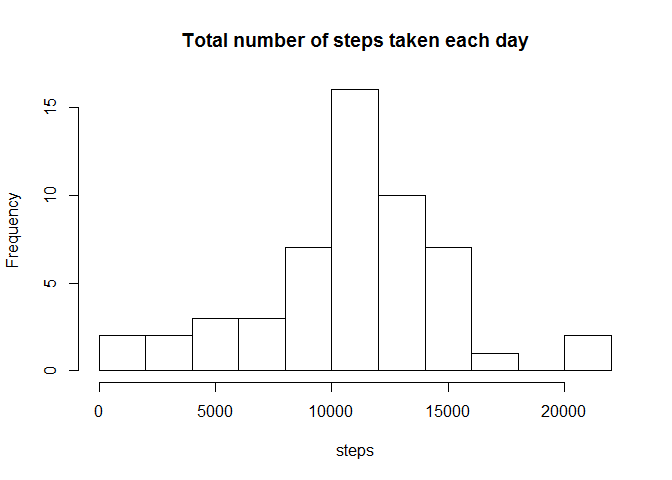
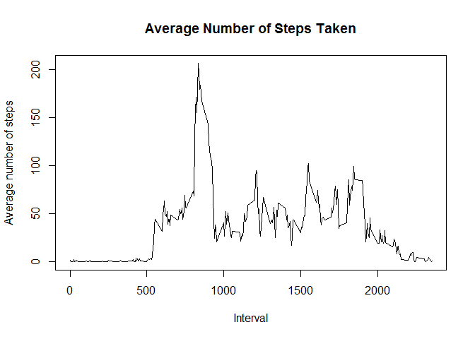
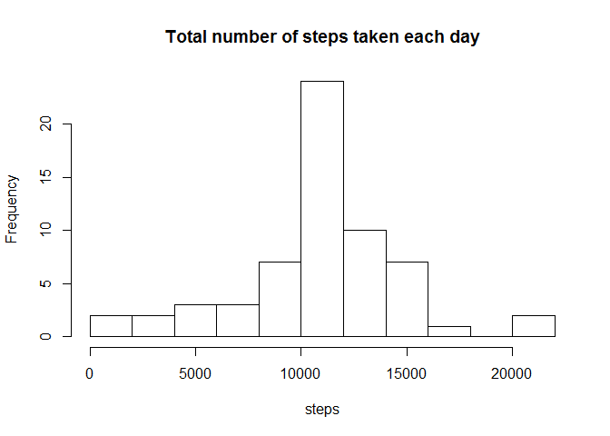
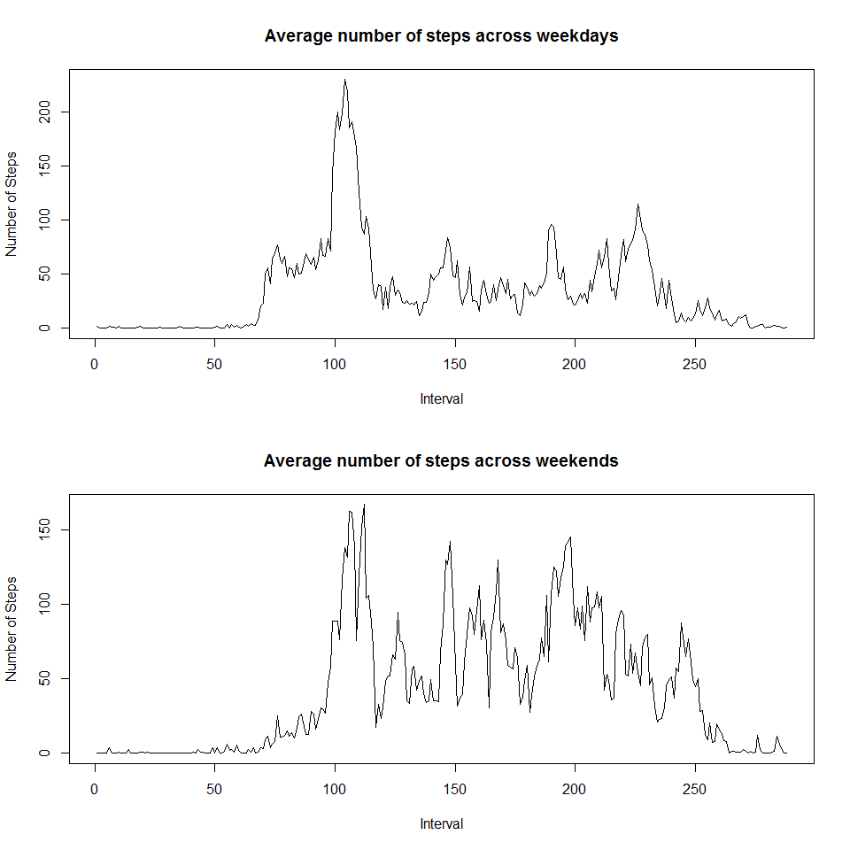

# Assignment1 (Reproducible Research)
1. Downloading data, unzipping and reading it.

```r
if(!file.exists("activity.csv")){
        Url<-"https://d396qusza40orc.cloudfront.net/repdata%2Fdata%2Factivity.zip"
        download.file(Url, destfile = "activity.zip")
        unzip("activity.zip")
}
activity<- read.csv("activity.csv", sep=",", stringsAsFactors=FALSE)
Sys.setlocale(category = "LC_ALL", locale = "english")
```

```
## [1] "LC_COLLATE=English_United States.1252;LC_CTYPE=English_United States.1252;LC_MONETARY=English_United States.1252;LC_NUMERIC=C;LC_TIME=English_United States.1252"
```
2. Changing the data column to a better format


```r
        activity$date<- as.Date(activity$date)
```
3.Identifying the mean of steps per day
First, we identify the number of missing values in the steps column and in the whole data set

```r
sum(is.na(activity))
```

```
## [1] 2304
```

```r
sum(is.na(activity$steps))
```

```
## [1] 2304
```
We can see that all missing values are in the steps column. Then create a data set that does not include missing values

```r
no_na_activity<-activity[complete.cases(activity$steps), ]
```
Next, we calculate the sum of steps per day to later identify the mean of steps per each day

```r
sum_per_day <- tapply(no_na_activity$steps, no_na_activity$date, sum)
```
Third, we create a histogram that shows total number of steps per each day

```r
hist(sum_per_day, main = "Total number of steps taken each day", xlab= "steps", breaks=10)
```

<!-- -->

Next, we calculate the mean and the median number of steps for each day

```r
mean(sum_per_day)
```

```
## [1] 10766.19
```

```r
median(sum_per_day)
```

```
## [1] 10765
```
To create a time series plot of the average number of steps taken per interval, we calculate mean of steps on each time interval and create a plot to show this data

```r
avg_steps<- tapply(no_na_activity$steps, no_na_activity$interval, mean)
plot(y=avg_steps, x=names(avg_steps), main="Average Number of Steps Taken", xlab="Interval", ylab="Average number of steps", type="l")
```

<!-- -->
Identifying the maximum average number of steps

```r
avg_steps[avg_steps==max(avg_steps)]
```

```
##      835 
## 206.1698
```
Next, we will replace missing values with the mean of the 5-minute intervals

```r
act_repl<-activity
act_repl[which(is.na(act_repl$steps)),1] <- avg_steps[as.character(act_repl[which(is.na(act_repl)),3])]
```
Now we will check whether the data set has any missing values left

```r
sum(is.na(act_repl))
```

```
## [1] 0
```
Then we will create the histogram that will be based on data with the replaced values of missing data


```r
avg_steps_repl<- tapply(act_repl$steps, act_repl$date, sum)
hist(avg_steps_repl, main = "Total number of steps taken each day", xlab= "steps", breaks=10)
```

<!-- -->

As we can see the mean has stayed the same while median has changed by :

```r
mean(avg_steps_repl) - mean(sum_per_day)
```

```
## [1] 0
```

```r
median(avg_steps_repl) - median(sum_per_day)
```

```
## [1] 1.188679
```
Next, we will compare the average number of steps taken per 5-minute interval across weekdays and weekends
First, we create a new column w_day that will show the week day of the date and a column fw_day that will include two factors - weekend and weekday


```r
act_repl$w_day <- weekdays(act_repl$date)
act_repl$fw_day<-as.factor(c("weekend", "weekday"))
```
Next we will create a command for assigning factors "weekday" and "weekend" for the column fw_day

```r
act_repl[act_repl$w_day == "Saturday" |act_repl$w_day == "Sunday", 5] <- factor("weekend")
act_repl[!(act_repl$w_day == "Saturday" |act_repl$w_day == "Sunday"), 5] <- factor("weekday")
```
Finally, we will choose subsets of the column with "weekend" and "weekday" factors and calculate mean for steps depending on these two factors.


```r
weekday<- subset(act_repl, fw_day == "weekday")
weekend<- subset(act_repl, fw_day == "weekend")
avg_steps_weekday<-tapply (weekday$steps, weekday$interval, mean)
avg_steps_weekend<-tapply(weekend$steps, weekend$interval, mean)
```
Now we will create plots to compare the average number of steps taken across weekdays and weekends


```r
par(mfrow=c(2,1))
plot(avg_steps_weekday,xlab="Interval", ylab="Number of Steps",
     type="l",main="Average number of steps across weekdays")
plot(avg_steps_weekend,xlab="Interval", ylab="Number of Steps",
     type="l",main="Average number of steps across weekends")
```

<!-- -->

As we can see in the plot above, the activity pattern is really different in weekdays than in weekends, the activity starts almost one hour later on weekends and the number steps taken stays higher in during the day in weekends.


